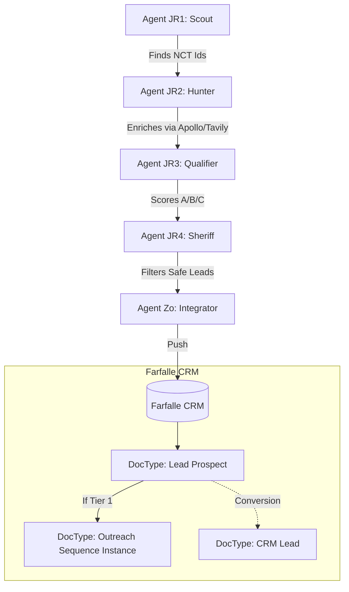

# EAIA Harvest Integration: "The Feed"

## Overview
Connects **Operation Harvest** (The Army) to **Farfalle CRM** (Frappe).
The Army does not dump data directly into your clean `CRM Lead` database.
Instead, it utilizes the `Lead Prospect` buffer to ensure high-quality data stewardship.

## The Data Flow

## Mapping Schema

The **Zo Agent** maps `LeadProfile` (Python) to `Lead Prospect` (Frappe):

| Agent Field | Frappe Field | Logic |
| :--- | :--- | :--- |
| `name` | `pi_name` | Direct map |
| `email` | `pi_email` | **Crucial**: If empty, Prospect is Tier 3 (Cold) |
| `organization_id` | `institution` | Direct map |
| `source_trial` | `source_ref_id` | Stores NCT Number |
| `role` | `notes` | "Role: PI" or "Role: Coordinator" |
| `score` | `lead_score` | Integer (0-100) |
| `tier` | `tier` | Score > 75 = Tier 1, > 40 = Tier 2 |

## Automated Actions

### 1. Ingestion
Every time the Army finishes a mission, `Lead Prospect` records are upserted (deduplicated by `pi_email`).

### 2. Sequencing (The "Air Support" Handoff)
If a Prospect is **Tier 1 (Score > 75)** AND **Compliance Passed**:
- Zo creates an `Outreach Sequence Instance`.
- Sequence: `SITE_ACTIVATION_V1` (or dynamic selection).
- Status: `Active`.

### 3. User Workflow in Farfalle
1.  Go to **Lead Prospect** List.
2.  Filter by `Source: ClinicalTrials`.
3.  See new "Tier 1" prospects arriving.
4.  Monitor `Outreach Sequence Instance` to see emails going out.
5.  When they reply, converting them to `CRM Lead` is a one-click action (or auto-hook).

## Technical Implementation
- **Script**: `eaia/agents/zo.py`
- **Auth**: Uses `frappe-client` with API Key/Secret from `.env`.
- **Endpoint**: `/api/resource/Lead Prospect`
